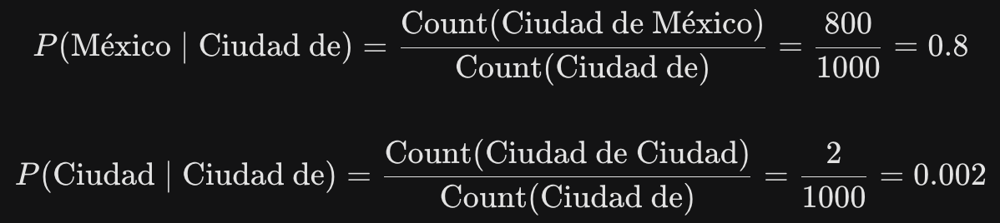

# edu-llm


### Distribución de probabilidad
Para entender los LLMs, la **distribución de probabilidad** es un concepto base. A partir del contexto previo, el modelo asigna un porcentaje de probabilidad a cada palabra de su vocabulario. Luego, utilizando estos valores, el modelo selecciona la próxima palabra a generar, permitiendo crear texto coherente.

Si no existe el contexto, a pesar de tener un mayor porcentaje la palabras asignada no tendría sentido, como es en el caso de la función random.choices , la cual se basa en el porcentaje asignada a las palabras para definir cuál elegirá.

En el siguiente [ejemplo](https://github.com/EduDN/edu-llm/blob/main/distribucion_probabilidad/distribucion_probabilidad.py) se muestra como manualmente nos encargamos de definir estos % con base en el contexto de la oración y la **random.choices** define con base en ese número qué palabra tendrá que elegir.

```python
import random

candidate_words = ["ingeniero", "homeless", "loco"]

# Las probabilidades de c/palabra están definidas
your_mental_model = [0.99, 0.001, 0.009]

chosen_word = random.choices(candidate_words, weights=your_mental_model)

print(f"Edu es {chosen_word[0]}.")
```

Referencias al tema: [How Small Can Language Models Be and Still Speak
Coherent English?](https://arxiv.org/pdf/2305.07759)


### N-Grams

Mediante el análisis estadístico de qué palabras aparecen frecuentemente juntas o en contextos similares, como "enchiladas verdes", un modelo puede calcular la probabilidad de que **coocurran**. A partir de ahí, puede inferir que "enchiladas" es una palabra con alta probabilidad de seguir a "verdes". Mientras que una palabra como "azules", tiene menor probabilidad de que **coocurran** bajo ese contexto.

La probabilidad de la siguiente palabra, dada una anterior, puede expresarse como una probabilidad condicional.

Un n-gram es la expresión de esto, se refiera a la secuencia de n cantidad de palabras que aparecen juntas dentro de un texto y lo cual lo convierte en una forma efectiva de encontrar patrones en en lenguaje.


"Edu tiene hambre entonces".


This can be split up into n-grams of different lengths:


* Unigrams (
) palabras individuales:

Edu ,tiene ,hambre, entonces


* Bigrams (
) pares de palabras:

Edu tiene, tiene hambre, hambre entonces


* Trigrams (
) secuencias de 3:

Edu tiene hambre, tiene hambre entonces


Ahora considera un ejemplo usando un trigrama. Si "Ciudad de México" aparece 800 veces en tu conjunto de datos, pero "Ciudad de Ciudad" aparece muy rara vez, puedes predecir que es mucho más probable que la palabra "México" le siga al bigrama "Ciudad de". Podemos asumir que ese "Ciudad" extra es probablemente un error tipográfico o una frase inusual en los datos. Este hecho se puede utilizar para estimar las probabilidades de un modelo de lenguaje:


El numerator Count(Ciudad de México) es el número de veces que las palabras  "Ciudad de México" aparecen en el texo. 

El denominator Count(Ciudad de) es el número de veces que las palabras "Ciudad de" aparece en el texto. 

La fórmula da la probabilidad nos dice que la probabilidad de que la siguiente palabra sea “México” justo después de haber visto “Ciudad de” sea de 0.8



Referencias al tema: [Conditional Probability
](https://www.probabilitycourse.com/chapter1/1_4_0_conditional_probability.php)
